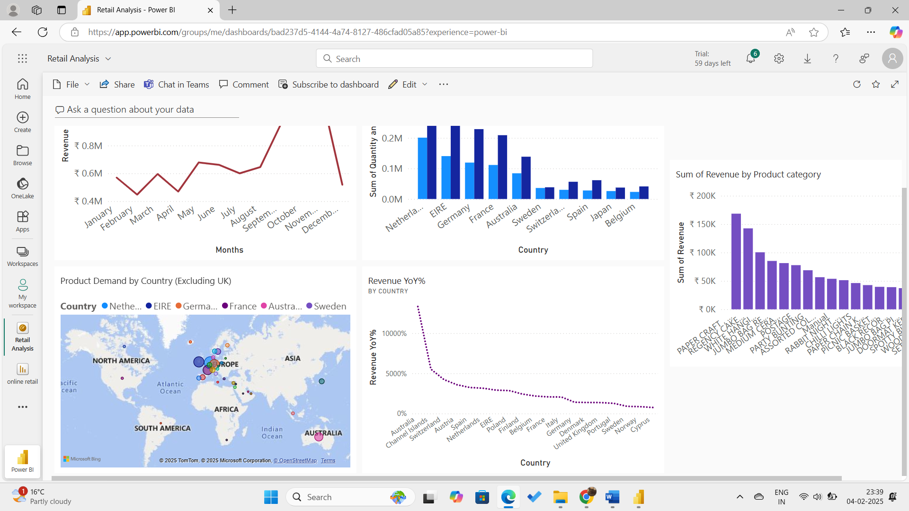
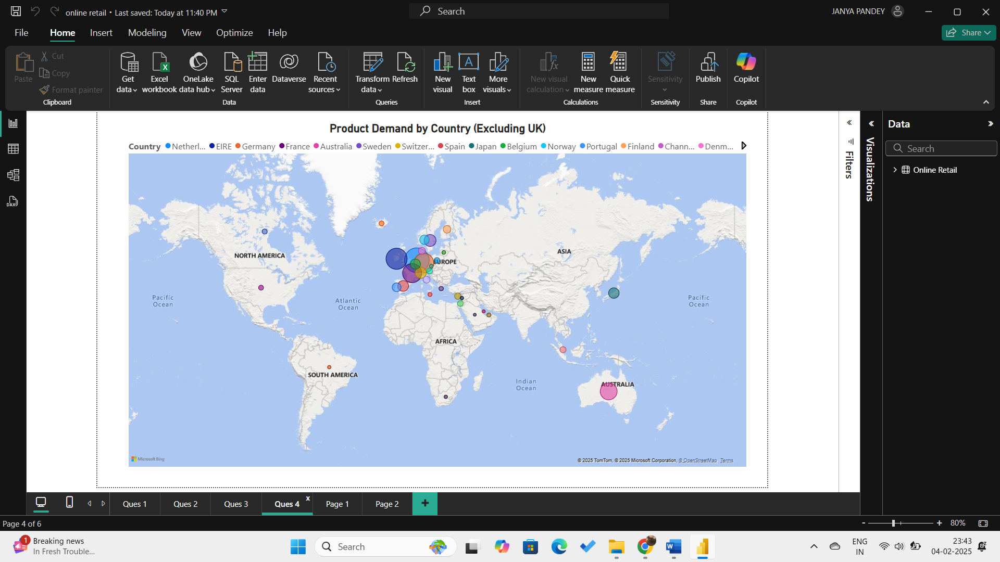

# PowerBI-Retail
Power BI Sales dashboard on Online retail dataset
# Power BI Sales Dashboard

## Overview
This repository contains a Power BI dashboard that provides insightful analysis of global sales data. The dashboard was created to demonstrate the use of Power BI for data visualization and storytelling. It includes advanced DAX calculations, dynamic filtering, and interactive visuals to uncover key business insights.

---

## Key Features
- **Revenue Analysis**: Yearly, monthly, and weekly trends.
- **Top Performers**: Best-selling products and top revenue-generating customers.
- **Geographical Insights**: Country-wise sales performance.
- **Dynamic Interactions**: Filters and slicers for exploring the data from multiple perspectives.

---

## Tools and Techniques
- **Power BI Desktop**: Data modeling, visualizations, and report creation.
- **DAX (Data Analysis Expressions)**: Used for calculated columns, measures, and time intelligence.
- **Power Query Editor**: Data import, cleanup, and transformation.
- **Datasets**: Utilized a sales dataset containing fields like `Order Date`, `Revenue`, `Customer ID`, `Country`, and `Product Name`.

---

## Files Included
1. **'Online retail.pbix`**  
   - The Power BI report file containing all visuals, data model, and calculations.

2. **`Online Retail.xlsx`**  
   - The dataset used for creating the dashboard.

3. **`README.md`**  
   - Documentation about the project.

4. **Screenshots**  
   - `overview.png`: A snapshot of the full dashboard.  
   - `Product_demand.png`: A visual showing product demand by country.

---

## Key Insights
1. **Revenue Trends**:  
   - Revenue peaked in Q4, indicating seasonal buying patterns.  
   - Consistent growth year-over-year (YoY) by approximately 15%.

2. **Top Performers**:  
   - Product `X` generated the highest revenue in 2021.  
   - Customer `ABC123` accounted for 8% of total sales.

3. **Geographical Insights**:  
   - The U.S. contributed 40% of total revenue, followed by the U.K. and Germany.  
   - Emerging markets like India showed the highest YoY growth rate.

4. **Sales Channels**:  
   - Online sales grew faster than offline channels, signaling a shift in customer preferences.

---

## How to Use
1. Download the `.pbix` file (`Sales_Dashboard.pbix`) from the repository.
2. Open it in **Power BI Desktop**.
3. If prompted, load the dataset (`Sales_Data.csv`) to ensure all visuals work as intended.
4. Explore the dashboard using the slicers and filters provided.

---

## Visuals
### Dashboard Overview

### Top Products

---

## Future Improvements
- Add predictive analytics to forecast future sales.
- Implement real-time data connections for live dashboards.
- Integrate KPIs like profit margin and customer acquisition cost.

---

